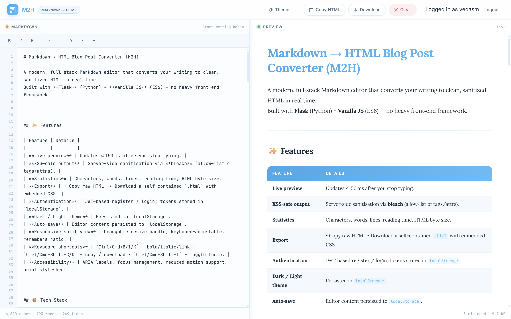
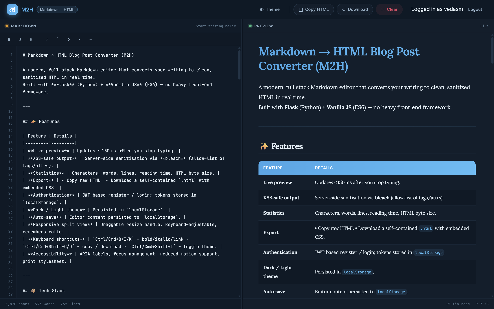

# M2H

A split-screen Markdown editor. Type on the left, get clean HTML on the right, export when you're happy with it.

I built this after one too many blog drafts written in Markdown and hand-copied into an online converter to get HTML for a CMS. M2H does that conversion in one place, plus a couple of things I wanted for myself while writing — an outline panel and a word-goal tracker.




## Features

- **Live preview** — Markdown on the left turns into HTML on the right as you type. Debounced, so it's not hitting the server on every keystroke.
- **Outline panel** — every heading in your draft shows up as a clickable, indented list, so you can jump around a long post instead of scrolling. Runs client-side against the last rendered preview, no extra request.
- **Word goal + streak** — set a word target for whatever you're writing; a progress bar fills as you type. Hit the target for the first time in a day and it counts toward a streak, stored in `localStorage` and reset if you miss a day.
- **Copy / download** — copy the rendered HTML to your clipboard, or download it as a standalone `.html` file with the CSS inlined server-side, so it opens fine on its own.
- **Sanitised output** — everything from the Markdown parser passes through `bleach` with an explicit tag/attribute allowlist before it hits the page, so a stray `<script>` in a draft (or a paste) can't run.
- **Accounts** — username/password auth with JWTs. Right now it just gates the editor; it's the seam for per-user draft storage later.
- **The usual editor stuff** — dark mode, auto-save, resizable panes, and `Ctrl/Cmd+B/I/K` shortcuts. Theme and draft persist in `localStorage`; the pane split is draggable and remembers your ratio.

## Stack

Flask backend — `markdown` for parsing, `bleach` for sanitising, `Flask-SQLAlchemy` + `PyJWT` for auth. Frontend is plain HTML/CSS/JS: no build step, no framework, readable by just opening the files.

## Running it

```bash
git clone https://github.com/vedasm/M2H.git
cd M2H

python -m venv .venv
source .venv/bin/activate      # Windows: .venv\Scripts\activate

pip install -r requirements.txt
python app.py
```

Open `http://localhost:5000`. Flask serves the page at `/` and the API under `/api/*` — no separate frontend server needed.

By default, users are stored in a local SQLite file (`users.db`, created on first run). Set `JWT_SECRET` before doing anything real with it — the fallback in `app.py` is fine for poking around locally, not for sharing:

```bash
export JWT_SECRET=$(python -c "import secrets; print(secrets.token_hex(32))")
```

Other env vars: `DATABASE_URL` (any SQLAlchemy URL, defaults to the SQLite file above; also picks up `TURSO_DATABASE_URL`/`TURSO_AUTH_TOKEN` for Turso), `FLASK_ENV`, `PORT`.

## API

Everything except `/api/register` and `/api/login` needs `Authorization: Bearer <token>`.

| Method | Path             | Body                      | Returns                                    |
| ------ | ---------------- | ------------------------- | ------------------------------------------ |
| POST   | `/api/register`  | `{ username, password }`  | `{ token, username }`                      |
| POST   | `/api/login`     | `{ username, password }`  | `{ token, username }`                      |
| POST   | `/api/convert`   | `{ markdown }`             | `{ html, stats }`                          |
| POST   | `/api/download`  | `{ markdown }`             | `{ html, filename }` — full standalone doc |

Usernames: 3–80 characters, letters/numbers/underscores only. Passwords: 8+ characters. `stats` covers character/word/line counts, an estimated reading time, and the generated HTML's size — that's what feeds the counters under the editor.

## Deploying

`vercel.json` and `api/index.py` are there so this drops onto Vercel as-is (`api/index.py` just imports the Flask app for Vercel's Python runtime to find). Anywhere else, `python app.py` behind a WSGI server works the same way.

## Project layout

```
.
├── app.py            # Flask app: auth, markdown → HTML, sanitisation, stats
├── api/index.py      # thin entry point for Vercel's Python runtime
├── app.js             # editor UI, live preview, outline, goal/streak, auth UI
├── index.html         # the page itself
├── styles.css         # theming and layout
├── vercel.json
└── requirements.txt
```

## Rough edges

- No rate limiting on `/api/login` or `/api/convert` — fine for personal use, not for strangers.
- Drafts live in `localStorage`, not per-account server-side storage, so switching browsers loses your draft even while logged in on both. Accounts currently just gate the editor, they don't sync anything.
- No test suite yet.

## License

MIT © 2026 vedasm